  

## About

I'm a software developer and a Computer Science student at Karatina University (class of 2028). I build web applications from the interface people see to the API and database behind it, and I also work in Python, C and C++.

- Frontend contributor on **Nettoon**, a Next.js streaming platform
- Building **TimSol Technologies**, my own brand and portfolio site
- Based in Kenya, open to junior roles and freelance projects

## What I Do

  

## Tech Stack

**Languages**

  
  
  
  
  
  
  

**Frameworks and libraries**

  
  
  
  
  
  
  
  

**Databases**

  
  
  

**Tools**

  
  
  

## Projects

### Personal Portfolio
My portfolio site, built around a strict design system and a responsive layout.  
HTML, CSS, JavaScript · https://timothy-dev-tech.github.io/timPortfolio/

### Karatina Tech & Repair
Website for a local tech and repair shop, with services and a working contact form.  
HTML, CSS, JavaScript · https://timothy-dev-tech.github.io/Karatina-tech-repair/

### Login Page
Responsive login form with client-side validation, extended with an Express, MongoDB and JWT backend.  
HTML, CSS, JavaScript, Express, MongoDB · https://timothy-dev-tech.github.io/LOGIN-PAGE-PROJECT/

### Nettoon (contribution)
Frontend work on a Next.js streaming platform, including a multi-tab video upload flow with drafts, playlists and scheduled publishing.  
Next.js, React, TypeScript, Tailwind CSS

### Expense Tracker (in progress)
Command-line ledger in Python on SQLite, with validated transactions, integer-cent amounts and custom categories.  
Python, SQLite

### TimSol Technologies (in progress)
My brand and portfolio site, built with React and TypeScript.  
React, TypeScript, Tailwind CSS, Express, MongoDB · https://timsol.dev

## Connect

- GitHub: https://github.com/Timothy-dev-Tech
- Website: https://timsol.dev
